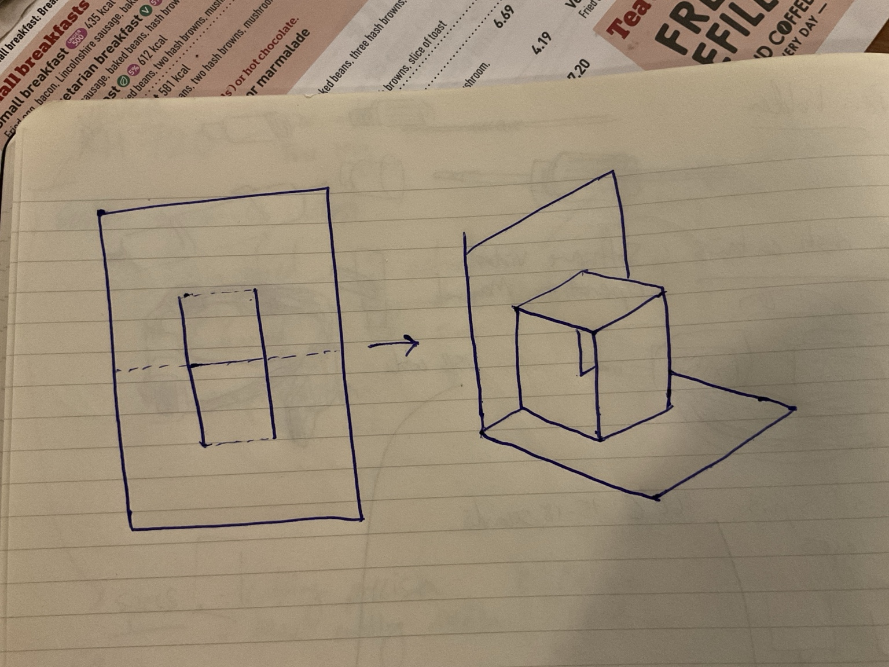

---
title: "Kirigami Pop-up Mechanism"
source: "ChatGPT conversation JSON"
exported_at_utc: "2026-06-22T18:54:27Z"
---

# Kirigami Pop-up Mechanism

## User

> _User (created=2026-06-22T10:47:50Z, id=d426a974-dc19-4d68-a206-05734589d9f2)_



I want to describe an idea to you and check that you grok it before continuing.  In [the picture](my_popup_drawing.jpeg) is a 2d image on the left, representing a piece of paper with 2 vertical lines cut in the middle. There are various other horizontal lines, some dashed, that represent folds. The image on the right is the resulting 3d shape that the cut paper can form, by folding the paper into 90º then pushing out the square from the middle.

Perhaps you can explain your understanding, or, even better, reference some other material (on the web) that illustrates this subject.

What I want to do next is generalise this pattern and make the designs computable and renderable in software. But let’s hold off that at the mo.

---

## Assistant

> _Assistant (created=2026-06-22T10:47:57Z, id=60165955-e600-4572-b035-32cda1a40b1b)_

Yes, I think I grok it.

You’re describing a **single-sheet cut-and-fold pop-up / kirigami mechanism**. The flat state is a 2D crease-and-cut pattern: the two vertical cuts free a central rectangular flap from the surrounding sheet, while the horizontal crease lines define hinges. When the whole sheet is folded along a main horizontal valley fold to about **90°**, the freed central region can be displaced out of the plane, becoming a little rectilinear “box” or cuboid projection. The paper is not being assembled from separate pieces; the 3D form is implicit in the topology of cuts plus the mountain/valley fold assignment.

The closest established terms are:

**Origamic architecture** — pop-up architectural paper structures, often displayed open at **90°**, made by cutting and folding a single sheet. Masahiro Chatani is usually credited with popularising or founding this form in the 1980s. One source describes it as transforming a 3D object into a 2D pattern and back again. See [Origamic Architecture | PDF](https://www.slideshare.net/slideshow/origamic-architecture/4066008).

**Kirigami** — the broader art/engineering category where cutting plus folding produces deployable 3D structures. Your example is a very clean rectilinear kirigami / pop-up unit. See [Kirigami: pop-up sculptures and origamic architecture](https://www.lrcrafts.it/kirigami-pop-up-sculptures-origamic-architecture/).

There is also current technical literature treating these as **popup structures** with parameterised cut-fold unit cells. A recent paper describes the simplest popup unit as resembling a **four-bar mechanism**, with geometric parameters such as cut length, popup height, and fold width, and discusses a design pipeline from desired 3D shape back to cut-fold pattern. That sounds quite close to the direction you’re heading: computable patterns and renderable/deployable geometry. See [Geometry and design of popup structures](https://arxiv.org/abs/2603.07067) and the local copy [arxiv-2603.07067.pdf](arxiv-2603.07067.pdf).

A useful way to restate your specific sketch is:

> A rectangular sheet has a main fold line. A pair of parallel cuts straddling that fold free a rectangular panel. Additional fold segments make that panel act like a hinged pop-up linkage. When the backing sheet is opened to 90°, the freed panel folds into a protruding rectangular prism-like volume.

The key thing I see is that the 2D drawing is not merely a template; it is a **mechanical program**. The cuts define which regions remain connected, and the creases define the allowed hinge axes. The 3D result follows from satisfying those hinge constraints while the base sheet is opened.

For later generalisation, the important ingredients will probably be: planar faces, cut edges, crease edges, mountain/valley signs, hinge angles, and constraints that prevent faces stretching or tearing. But yes, holding off there: conceptually, I understand the class of object you mean.

---

## User

> _User (created=2026-06-22T11:41:27Z, id=68b2d3e0-a667-4802-b68c-1797c96c1c98)_

can you read that last arXiv paper and comment on whether they don’t include inward cuboids?

---

## Assistant

> _Assistant (created=2026-06-22T11:41:38Z, id=f24ce35f-6409-4581-b6e6-cfb8d080a7e5)_

Yes — my read is that **they do not really include “inward cuboids” in the sense you mean**, at least not as first-class primitives in their geometry.

Their primitive is the same broad family as your sketch: a **two-cut, three-fold rectangular pop-up unit**. They parameterise a unit by positive lengths $l_x, l_z$ and width $l_y$, and the fold vertex follows a deployment trajectory of the form roughly:

$$
r(\Psi) = [l_x + l_z \cos(\Psi)]\,\hat{x} + l_z \sin(\Psi)\,\hat{z}
$$

with deployment angle $\Psi$. Since $l_z$ is a positive cut length and $\sin(\Psi)$ is positive over the deployment range they use, the vertex height is implicitly **one-sided**: the unit pops out to the same side of the sheet. Their Figure 1A also illustrates the unit as an outward rectangular pop-up, matching that convention. See [Geometry and design of popup structures](https://arxiv.org/abs/2603.07067) or the local [arxiv-2603.07067.pdf](arxiv-2603.07067.pdf).

They do include **negative Gaussian curvature**, **concave mean curvature regions**, and saddle-like or concave global surfaces, but that is not the same as having individual cuboids that pop “inward” through the base sheet. Their curvature signs arise from the relative heights and arrangement of many outward pop-up units, then triangulating the fold vertices into a surface. See [Geometry and design of popup structures](https://arxiv.org/abs/2603.07067).

So I would distinguish three cases:

1. **Outward cuboid unit** — included. This is their basic unit.

2. **Global concave/saddle surface made from many outward units** — included. They explicitly demonstrate zero, positive, and negative Gaussian curvature structures. See [Geometry and design of popup structures](https://arxiv.org/abs/2603.07067).

3. **Mixed outward/inward cuboids, where some local units protrude into the inside/back side of the folded sheet** — apparently **not included** in their model or examples.

The mathematical tell is that there is no obvious signed height variable, no mountain/valley inversion flag per unit, and no treatment of units passing to the opposite side of the base fold. Their pipeline samples target surfaces, optimises positive cut parameters, and generates a cut-fold pattern using solid lines for cuts and dashed lines for folds; it does not appear to encode “this unit deploys inward instead of outward” as a design degree of freedom. See [Geometry and design of popup structures](https://arxiv.org/abs/2603.07067).

For your computable generalisation, that suggests a useful extension: give each pop-up cell an **orientation sign** or **fold-side parity**, e.g.

$$
z = s \, l_z \sin(\Psi), \quad s \in \{-1,+1\}
$$

where $s=+1$ means outward and $s=-1$ means inward. But then you immediately get extra constraints: self-intersection with the backing sheet, collisions between neighbouring cells, and consistency of mountain/valley fold assignments. Those are exactly the things their paper seems to avoid by staying with a one-sided pop-up convention.

---

## User

> _User (created=2026-06-22T11:43:08Z, id=e8fa092e-d1d7-45d5-8ae0-d7c0298cdf46)_

do you know of any work which includes this generalisation?

---

## Assistant

> _Assistant (created=2026-06-22T11:43:26Z, id=c6f14516-96bb-4105-aca8-93e5173079f0)_

I don’t know of a paper that exactly says: **“take the simple 90° cuboid OA unit and add a signed inward/outward cuboid variable per cell.”** The closest bodies of work are adjacent rather than identical.

The nearest relevant work I found is **v-style pop-ups**. Li, Ju, Gu, and Hu study a broader class of pop-ups where patches fall into **four parallel groups**, rather than the simpler OA-style case where patches alternate between two planes. They give sufficient pop-up validity conditions and algorithms for interactive/automatic design. That generalises the kinematics, but it is still not quite “signed cuboids in a rectilinear grid.” See [A Geometric Study of V-style Pop-ups: Theories and Algorithms](https://www.researchgate.net/publication/224942696_A_Geometric_Study_of_V-style_Pop-ups_Theories_and_Algorithms).

Another close branch is **multi-style paper pop-up design from 3D models**. Ruiz et al. combine multiple pop-up mechanisms instead of using only one mechanism family, explicitly motivated by the limitation of earlier single-style systems. Again, this broadens the design space, but it is more “choose/mix mechanism types” than “a computable field of inward/outward cuboid protrusions.” See [Multi-style Paper Pop-up Designs from 3D Models](https://www.academia.edu/36120329/Multi_style_Paper_Pop_up_Designs_from_3D_Models).

A different but conceptually important match is **tucking origami**. Zhao et al. explicitly discuss adding **flaps outside** or **tucks inside** a folded origami shape; their method fills otherwise problematic blank areas in crease patterns by adding crease lines, and they show examples with tucks inside. That is probably the closest phrase-level analogue to your “inward” idea, but it is **origami without cutting**, axisymmetric/triangular-facet based, not the cut-and-fold cuboid pop-up unit you sketched. See [A Computational Design Method for Tucking Axisymmetric Origami Consisting of Triangular Facets](https://www.mdpi.com/2073-8994/10/10/469).

For comparison, the mainstream computational **OA-style paper pop-up** literature appears to stay closer to one-sided / parallel-configuration assumptions. Huang et al. define OA-style pop-up plans as a single rectangular sheet divided into non-overlapping patches, with fold lines parallel to the main fold line, and the 90° state as an orthogonal configuration where all patches are parallel to one of the two background patches. That model is compatible with stair-like outward constructions, but it does not obviously expose a local “inside/outside cuboid” degree of freedom. See [Image-Based OA-style Paper Pop-up Design via Mixed-Integer Programming](https://yongliangyang.net/docs/paperPopup_tvcg22.pdf).

So my best answer is:

**Yes, there is related work on richer pop-up mechanisms, v-style pop-ups, multi-style pop-ups, and inside tucks; but I have not found a direct computational OA/kirigami treatment of a rectilinear cuboid grid with per-cell inward/outward signed extrusion.**

That suggests your generalisation may be a genuine useful niche: a **signed-height OA cuboid grammar**. It would sit somewhere between classic origamic architecture, v-style pop-ups, and computational origami tucking. The likely search terms are:

`v-style pop-ups`, `multi-style paper pop-up design`, `origamic architecture`, `computational paper pop-up`, `tucking origami`, `kirigami signed height`, `pop-up book mechanism design`.

The phrase **“inward cuboid”** itself does not seem to be standard terminology; I’d probably describe it formally as **signed extrusion**, **inside/outside pop-up cell orientation**, or **bidirectional OA-style cuboid units**.

---

## User

> _User (created=2026-06-22T15:04:23Z, id=fc2730fd-90b2-420f-9b06-0efb7b9598ac)_

I’m sitting in a coffee shop with only my ipad to work on. In the past I’ve managed some pretty successful web programming using the Textastic app to create (and web preview) html with javascript.  Given this resource I’d like to play a little with this signed extrusion pop-up idea. I was thinking in the first instance that it may be nice to try and introduce some principled approach to organise the designs. For example, perhaps some constructive operators, a bit like CSG operators. Can you create a starting point for experimentation. Perhaps initially a single-page app that has a 2d view showing cuts and folds, and an interactive 3d view of the resulting folded pop-up. Since I’m on an ipad, the 3d view would be most naturally interacted with by sliding a single finger to rotate (like a rotating ball) and two fingers for zoom and pan.

---

## Assistant

> _Assistant (created=2026-06-22T15:05:53Z, id=7ff27287-020c-42cb-84a4-ada35dcf110a)_

I’ve made a single-file HTML starting point that should work well in Textastic: no external libraries, just HTML/SVG/canvas/JS.

[Download the single-page app](signed-extrusion-popup-sketcher.html)

It gives you:

- a **2D SVG pattern view** showing cuts, mountain folds, and valley folds;
- a **3D canvas view** showing a folded backing sheet plus signed cuboid extrusions;
- **tap-to-edit cells**: empty → outward → inward → empty;
- **one-finger 3D rotation**;
- **two-finger zoom/pan**;
- a small set of hackable “constructive operators” in the JS:
  - `addRect(x, z, w, h, sign)`
  - `mirrorX()`
  - `invertSigns()`

A caveat: this is not yet a true rigid-origami/kirigami solver. The 3D view is a **constructive signed-cuboid preview**: useful for exploring a grammar of designs, but not yet checking whether a crease pattern is physically valid, collision-free, or foldable from a single sheet.

The conceptual split I’ve encoded is:

```js
+1 = outward extrusion
-1 = inward extrusion
 0 = absent cell
```

That should give you a compact place to start experimenting on the iPad.

---

## User

> _User (created=2026-06-22T15:22:55Z, id=9fcc05f2-6a1d-4928-a7bb-598eff72855f)_

That’s pretty good, but I was wanting the 3d view to be literally correct, not symbolic. Also I don’t need the folding angle to be a parameter, so we can just fix it to be 90º for the 3d structure. Also, as a simplification perhaps we can consider the data structure for the entire design to be an array of N strips with widths w_i, i=1..N, and each strip s_i is an array of M_i lengths l_{i,j}, j=1..M_i, where the first length (possibly zero) l_{i,1} is considered to be a positively signed cuboid, then l_{i,2} is negatively signed, and so on.  There are some invariants of course, that each strip adds up to the same total ‘paper’ length, and likewise the sum of widths is the total paper width.

Hopefully this makes sense to you, and you can see how this structure therefore maps fairly easily into horizontal and vertical quads in 3d?

Please try again, but use the above constrained design.

---

## Assistant

> _Assistant (created=2026-06-22T15:25:26Z, id=9b4bd7fc-9eb1-4355-b885-a8967e04388e)_

Here’s a second version using your constrained strip representation:

[Download the revised single-page app](signed-strip-popup-quadmesh.html)

The data model is now:

```js
{
  widths: [w1, w2, ...],
  strips: [
    [l11, l12, ...],
    [l21, l22, ...],
    ...
  ]
}
```

with these invariants checked:

```js
widths.length === strips.length
sum(strips[i]) is the same for every strip
sum(widths) is the total paper width
```

In the 3D view, signs alternate by index:

```js
l[i][0] = positive / outward
l[i][1] = negative / inward
l[i][2] = positive / outward
...
```

and the model is fixed at the **90° folded state**.

Important implementation note: I’ve interpreted each strip as generating an explicit **axis-aligned quad mesh**: signed vertical quads plus horizontal connector quads at the fold boundaries. So the 3D view is no longer just symbolic cuboids; it is generated directly from the strip data as actual quads.

There’s still one modelling choice you may want to change next: I used

```js
y = sign * depthScale * length
```

so longer signed intervals protrude farther. If you instead want a fixed protrusion depth per strip, or a separate depth array, that’s a small change in `buildQuads()`.

---

## User

> _User (created=2026-06-22T15:38:47Z, id=471bb9a8-6785-4190-87b5-e4cffee28706)_

This is pretty good, but there are still some details I’d like to revise:
1. make the 3 views resizeable / collapsible,
2. Make there be an implicit 90º folded starting point. Let me elaborate by introducing some coordinates, let (x,y) be a cartesian coordinate system for the 2d paper, with origin at the leftmost horizontal location and half-way up the paper.  Then when the lower half of the paper is folded from 180º to 90º we will call this direction z, i.e. it would be pointing positively towards the user.  Suppose the paper has dimensions W, 2*H. Now given this, I want each strip to start at z=H.

Does this make sense?

---

## Assistant

> _Assistant (created=2026-06-22T15:41:14Z, id=7f439302-410f-4c03-8ade-db716e8f5f2d)_

Yes, that coordinate convention makes sense.

I’ve made a revised version with:

1. **Resizable panes** using draggable gutters.
2. **Collapsible panes** using the hide/show buttons.
3. A more explicit paper coordinate model:
   - flat paper coordinates: $x \in [0,W]$, $y \in [-H,H]$
   - fold line: $y=0$
   - upper half maps to the vertical plane: $(X,Y,Z)=(x,y,0)$
   - lower half maps to the horizontal plane: $(X,Y,Z)=(x,0,-y)$
   - therefore the lower edge $y=-H$ maps to **$z=H$**.
4. Each strip now starts from that lower edge, so the strip traversal begins at **$z=H$**.

[Download the revised 90° coordinate version](signed-strip-popup-90deg-coordinates.html)

One thing I’ve left deliberately concentrated in a single function is the remaining modelling choice:

```js
function signedHeight(length, sign) {
  return sign * heightScale * length;
}
```

So the coordinate framework is now closer to what you described, while the exact meaning of a “positive” or “negative” length interval in 3D can be adjusted locally.

---

## User

> _User (created=2026-06-22T15:55:33Z, id=544686bc-6535-4f1e-a02d-9fe0df20b7d0)_

Hmm, there’s still something not quite the way I want. Can you also include two very basic examples (in addition to your nice richer ones): 1. just a folded page, 2. a single step cuboid (that I sketched at the beginning of this chat).

Next, now that we have coordinates established, I should be clearer. Consider the first strip, let’s simplify the naming of it’s array to just l_1, l_2, l_3, …, l_N. The first segment of this strip should be horizontal in 3d, lying in the y=0 plane, starting at z=H and continuing to z=H-l_1. The next segment should be vertical, i.e. in the z=H-l_1 plane, and continue from y=0 up to y=l_2. The segments should continue to alternate from horizontal to vertical like this.

---

## Assistant

> _Assistant (created=2026-06-22T15:57:12Z, id=2eef4000-4c0a-4ba0-9135-fb37a0c60cd8)_

Yes — that clarification changes the model in an important way. I’ve revised it so each strip is now interpreted as an **alternating 90° polyline**:

$$
l_1:\text{ horizontal in }y=0,\quad
l_2:\text{ vertical at fixed }z,\quad
l_3:\text{ horizontal},\quad
l_4:\text{ vertical},\ldots
$$

starting at:

$$
(y,z)=(0,H)
$$

So the first segment runs from $z=H$ to $z=H-l_1$, exactly as you described.

[Download the updated alternating-segment version](signed-strip-popup-alternating-segments.html)

I also added the two basic examples:

1. **Basic: folded page** — just the lower horizontal half and upper vertical half.
2. **Basic: single step cuboid** — a central strip using a four-segment step profile, flanked by plain folded-page strips.

The validator now checks the stronger endpoint invariants:

```js
sum(l1, l3, l5, ...) === H
sum(l2, l4, l6, ...) === H
```

so each strip starts at the lower edge $z=H$ and ends on the upper sheet at $y=H, z=0$.

---

## User

> _User (created=2026-06-22T16:08:57Z, id=776d8f51-68e3-45e9-afa9-d58815379d3a)_

Yay! Excellent! Thank you!

One oddity, the folded page really can be simply:
```

{
  "widths": [
    1
  ],
  "strips": [
    [
      1,
      1
    ]
  ]
}
```
rather than your multi-strip complexity. Can you please use this simpler variant in your next iteration.

Can you now also add in some operators of your choosing. Candidate ideas: intersection, max, min, addition, subtraction. Perhaps there could be another operator view (also resizeable and collapsible) that offers buttons for the operators, and a list of variables v1, v2, etc which are each example, and selecting two lines (e.g. A then B) and hitting an operator op adds another variable whose value is the op(A, B)?  Perhaps it would be simplist to support operator expressions in input text fields one for each variable? Then simply javascript `eval` could be the mechanism for assigning v_i?

---

## Assistant

> _Assistant (created=2026-06-22T16:10:36Z, id=55224b63-ee68-4e4b-bcfa-45dcf07105b5)_

Excellent — I’ve made the next iteration with the simpler folded-page example and a new resizeable/collapsible **Operators / variables** pane.

[Download the operator version](signed-strip-popup-operators.html)

Changes included:

- The folded-page example is now exactly the simple form:

```json
{
  "widths": [1],
  "strips": [[1, 1]]
}
```

- Added a fourth pane for variables and operators.
- Variables are named `v1`, `v2`, etc.
- You can select two variables `A` and `B`, then apply:
  - `max(A,B)` / union-ish
  - `min(A,B)` / intersection-ish
  - `add(A,B)`
  - `sub(A,B)` / A−B
- There is also an expression field using JavaScript evaluation, with helpers:

```js
max(v1, v2)
min(v1, v2)
add(v1, v2)
sub(v2, v1)
intersection(v1, v2)
union(v1, v2)
clone(v1)
```

The operators currently act pointwise on the staircase height function $y(u)$, where $u=H-z$. They require the two operands to have matching strip widths and the same $H$. That is deliberately conservative, but it gives a principled basis for experiments.

---

## Linked resources

- [conversation7.json](conversation7.json)
- [arxiv-2603.07067.pdf](arxiv-2603.07067.pdf)
- [signed-extrusion-popup-sketcher.html](signed-extrusion-popup-sketcher.html)
- [signed-strip-popup-quadmesh.html](signed-strip-popup-quadmesh.html)
- [signed-strip-popup-90deg-coordinates.html](signed-strip-popup-90deg-coordinates.html)
- [signed-strip-popup-alternating-segments.html](signed-strip-popup-alternating-segments.html)
- [signed-strip-popup-operators.html](signed-strip-popup-operators.html)
